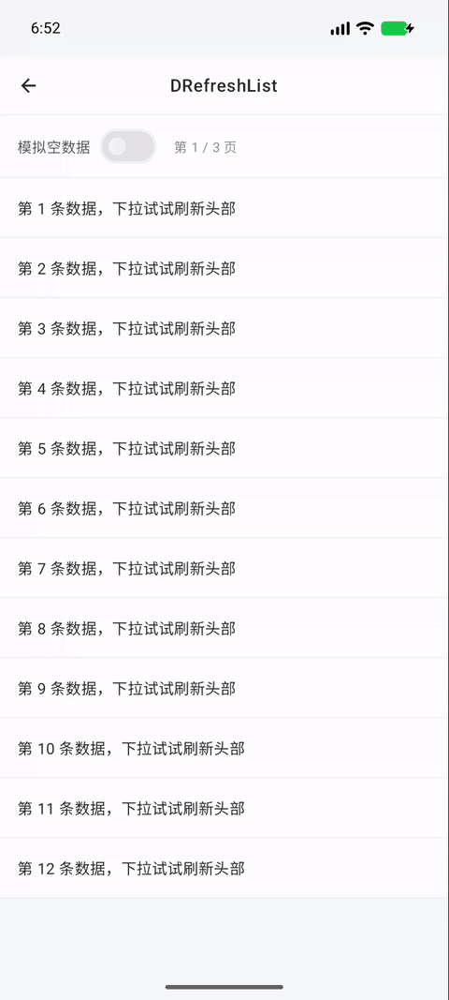
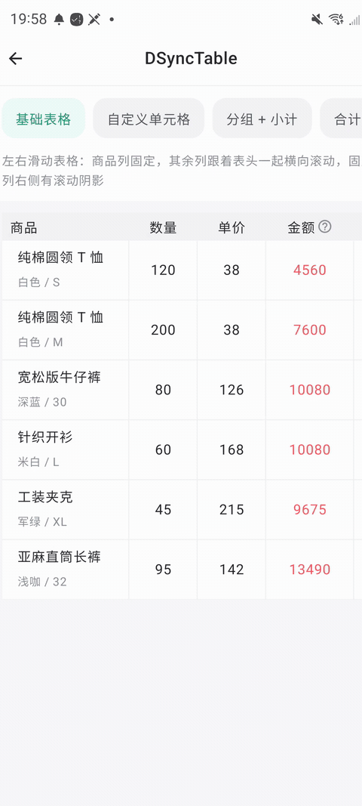
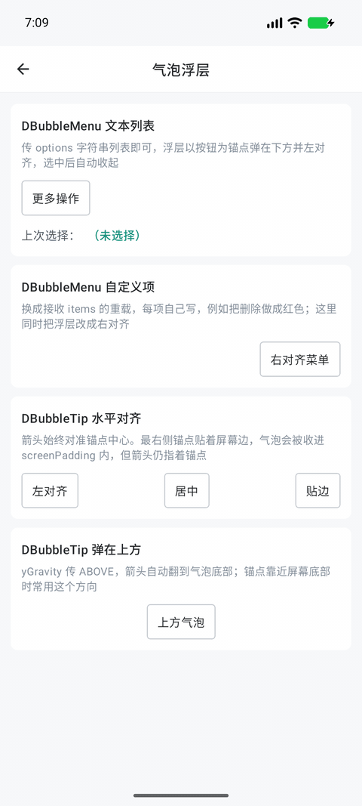
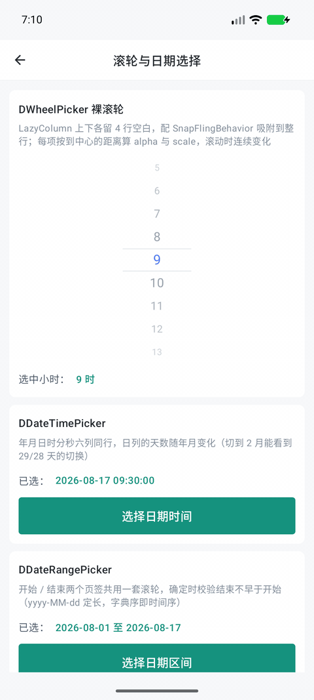
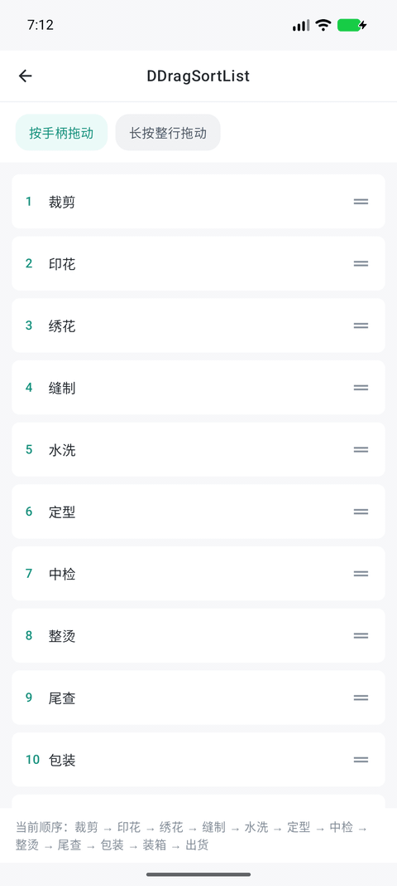
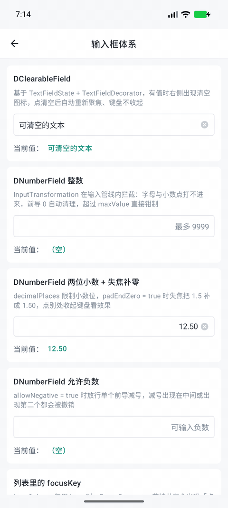

# DComposeUI

面向真实业务场景的 Jetpack Compose 组件与交互示例。

DComposeUI 把刷新、复杂表格、锚点浮层、滚轮选择、拖拽排序和输入校验等常见能力整理为可阅读、可运行的源码，并通过独立 Demo 展示状态管理、布局策略与交互边界。

> 当前仓库是单 `app` 模块示例工程，尚未发布 Maven 依赖。请直接阅读 Demo，或按需抽取组件源码到自己的项目中。

## 组件一览

| 组件 | 核心能力 | 源码 | Demo |
| --- | --- | --- | --- |
| `DRefreshList` | 下拉刷新、上拉加载、空态、无更多数据 | [源码](app/src/main/java/com/ddw/dcomposeui/widget/DRefreshList.kt) | [Demo](app/src/main/java/com/ddw/dcomposeui/demo/screen/DRefreshListDemo.kt) |
| `DSyncTable` | 冻结列、同步横滚、异构行、固定底部合计、纵向合并、自适应行高、无表头与空态 | [源码](app/src/main/java/com/ddw/dcomposeui/widget/DSyncTable.kt) | [Demo](app/src/main/java/com/ddw/dcomposeui/demo/screen/DSyncTableDemo.kt) |
| `DBubbleMenu` | 文本或自定义锚点菜单、安全区贴边 | [源码](app/src/main/java/com/ddw/dcomposeui/widget/DBubbleMenu.kt) | [Demo](app/src/main/java/com/ddw/dcomposeui/demo/screen/DBubbleDemo.kt) |
| `DBubbleTip` | 多方向提示气泡、箭头回指、点击外部关闭 | [源码](app/src/main/java/com/ddw/dcomposeui/widget/DBubbleTip.kt) | [Demo](app/src/main/java/com/ddw/dcomposeui/demo/screen/DBubbleDemo.kt) |
| `DWheelPicker` | `LazyColumn` 吸附滚轮、中心项视觉反馈、受控选中值 | [源码](app/src/main/java/com/ddw/dcomposeui/widget/DWheelPicker.kt) | [Demo](app/src/main/java/com/ddw/dcomposeui/demo/screen/DWheelPickerDemo.kt) |
| `DDateTimePicker` | 年月日时分秒联动选择与日期校正 | [源码](app/src/main/java/com/ddw/dcomposeui/widget/DDateTimePicker.kt) | [Demo](app/src/main/java/com/ddw/dcomposeui/demo/screen/DWheelPickerDemo.kt) |
| `DDateRangePicker` | 开始/结束日期选择与区间校验 | [源码](app/src/main/java/com/ddw/dcomposeui/widget/DDateRangePicker.kt) | [Demo](app/src/main/java/com/ddw/dcomposeui/demo/screen/DWheelPickerDemo.kt) |
| `DDragSortItem` | `LazyColumn` 拖拽排序、手柄/长按触发、边缘自动滚动 | [源码](app/src/main/java/com/ddw/dcomposeui/widget/DDragSortList.kt) | [Demo](app/src/main/java/com/ddw/dcomposeui/demo/screen/DDragSortDemo.kt) |
| `DClearableField` | 可清空输入框、焦点恢复、列表焦点隔离 | [源码](app/src/main/java/com/ddw/dcomposeui/widget/DClearableField.kt) | [Demo](app/src/main/java/com/ddw/dcomposeui/demo/screen/DInputFieldDemo.kt) |
| `DNumberField` | 整数/小数过滤、负数、最大值钳制、失焦格式化 | [源码](app/src/main/java/com/ddw/dcomposeui/widget/DNumberField.kt) | [Demo](app/src/main/java/com/ddw/dcomposeui/demo/screen/DInputFieldDemo.kt) |

## Demo 效果

点击名称可查看对应 Demo 源码。

<table>
  <tr>
    <td align="center">
      <a href="app/src/main/java/com/ddw/dcomposeui/demo/screen/DRefreshListDemo.kt"><strong>刷新列表</strong></a><br>
      
    </td>
    <td align="center">
      <a href="app/src/main/java/com/ddw/dcomposeui/demo/screen/DSyncTableDemo.kt"><strong>同步表格</strong></a><br>
      
    </td>
    <td align="center">
      <a href="app/src/main/java/com/ddw/dcomposeui/demo/screen/DBubbleDemo.kt"><strong>气泡浮层</strong></a><br>
      
    </td>
  </tr>
  <tr>
    <td align="center">
      <a href="app/src/main/java/com/ddw/dcomposeui/demo/screen/DWheelPickerDemo.kt"><strong>滚轮与日期选择</strong></a><br>
      
    </td>
    <td align="center">
      <a href="app/src/main/java/com/ddw/dcomposeui/demo/screen/DDragSortDemo.kt"><strong>拖拽排序</strong></a><br>
      
    </td>
    <td align="center">
      <a href="app/src/main/java/com/ddw/dcomposeui/demo/screen/DInputFieldDemo.kt"><strong>输入框</strong></a><br>
      
    </td>
  </tr>
</table>

## 如何复用

组件实现集中在：

```text
app/src/main/java/com/ddw/dcomposeui/widget/
```

对应示例集中在：

```text
app/src/main/java/com/ddw/dcomposeui/demo/screen/
```

仓库没有可用的 `implementation(...)` 坐标。建议从 Demo 追踪组件依赖，再把需要的源码、主题与扩展抽取到自己的 Library 模块中。

### `DSyncTable` DSL

```kotlin
val columns = listOf(
    DTableColumn<Order>(
        width = 120.dp,
        frozen = true,
        header = { Text("订单号") },
        cell = { Text(it.orderNo) },
    ),
    DTableColumn<Order>(
        width = 96.dp,
        header = { Text("数量") },
        cell = { Text(it.quantity.toString()) },
    ),
)

DSyncTable(
    columns = columns,
    modifier = Modifier.fillMaxSize(),
) {
    items(orders, key = { it.id })
    stickyFooterRow { columnIndex ->
        if (columnIndex == 0) Text("合计")
    }
}
```

`stickyFooterRow` 位于数据列表之外；要让长表滚动时合计行固定在底部，表格必须从父布局获得确定高度。`key` 参数目前只会被保存，渲染页脚时不会被消费，因此不要依赖它管理页脚身份；没有普通数据行时只展示空态，页脚不会渲染。

### `DDragSortItem` 组合式拖拽

```kotlin
val listState = rememberLazyListState()
val rows = remember { initialRows.toMutableStateList() }
val dragState = rememberDDragSortState(
    lazyListState = listState,
    onMove = { from, to ->
        rows.add(to, rows.removeAt(from))
    },
)

LazyColumn(state = listState) {
    items(rows, key = { it.id }) { row ->
        DDragSortItem(
            state = dragState,
            key = row.id,
        ) {
            Row(Modifier.longPressDraggableHandle()) {
                Text(row.title)
            }
        }
    }
}
```

`DDragSortItem.key` 必须与 `LazyColumn.items(key = ...)` 使用同一个稳定业务标识；`onMove` 收到位置变化后，需要立即同步可观察列表的顺序。

## 使用边界

| 组件 | 需要调用方保证的约束 |
| --- | --- |
| `DRefreshList` | 释放达到阈值只触发回调；回调内应立即将对应状态设为 `true`，成功、失败或取消后都复位为 `false`，且刷新与加载状态必须互斥 |
| `DSyncTable` | 自适应行和纵向合并会增加测量成本；大数据量性能请以 release 包为准 |
| `DBubbleMenu` | 自定义 `items` 重载无法判断何时选中，点击后需要调用方主动关闭 |
| `DBubbleMenu` / `DBubbleTip` | 超出窗口时会夹回安全区域，不会自动从下方翻转到上方 |
| `DWheelPicker` | `items` 必须非空、值应唯一，`selected` 必须属于列表；运行期间更换列表内容或长度可能让位置同步失效，更适合稳定列表 |
| `DDateTimePicker` / `DDateRangePicker` | 必须保证 `minYear <= maxYear` 且初始年份位于区间内；动态日列表需要先处理滚轮的位置同步问题；确认回调不会自动关闭弹窗 |
| `DDragSortItem` | 稳定 key 与及时换位是正确拖动的前提；状态会持有首次 `onMove` 和密度阈值，调用期间应保持其语义与显示密度稳定 |
| `DNumberField` | 输入只接受英文句点，输出却跟随默认 Locale，逗号小数地区尚未形成编辑闭环；`FLOOR` 对负数向负无穷舍入，`Double` 也不适合高精度金额 |

## 项目结构

```text
.
├─ app/src/main/java/com/ddw/dcomposeui/
│  ├─ demo/          # Demo 入口与示例页面
│  ├─ ext/           # Compose 扩展
│  ├─ theme/         # 应用颜色与主题
│  └─ widget/        # UI 组件实现
└─ images/gifs/      # README 演示动图
```

## 文章系列

组件实现背后的布局、状态与手势原理整理在 [DComposeUI 系列文章](https://gitee.com/withwudongdong/gzh/tree/master/Android/DComposeUI%E7%B3%BB%E5%88%97) 中。

## License

本项目基于 [MIT License](LICENSE) 开源。
